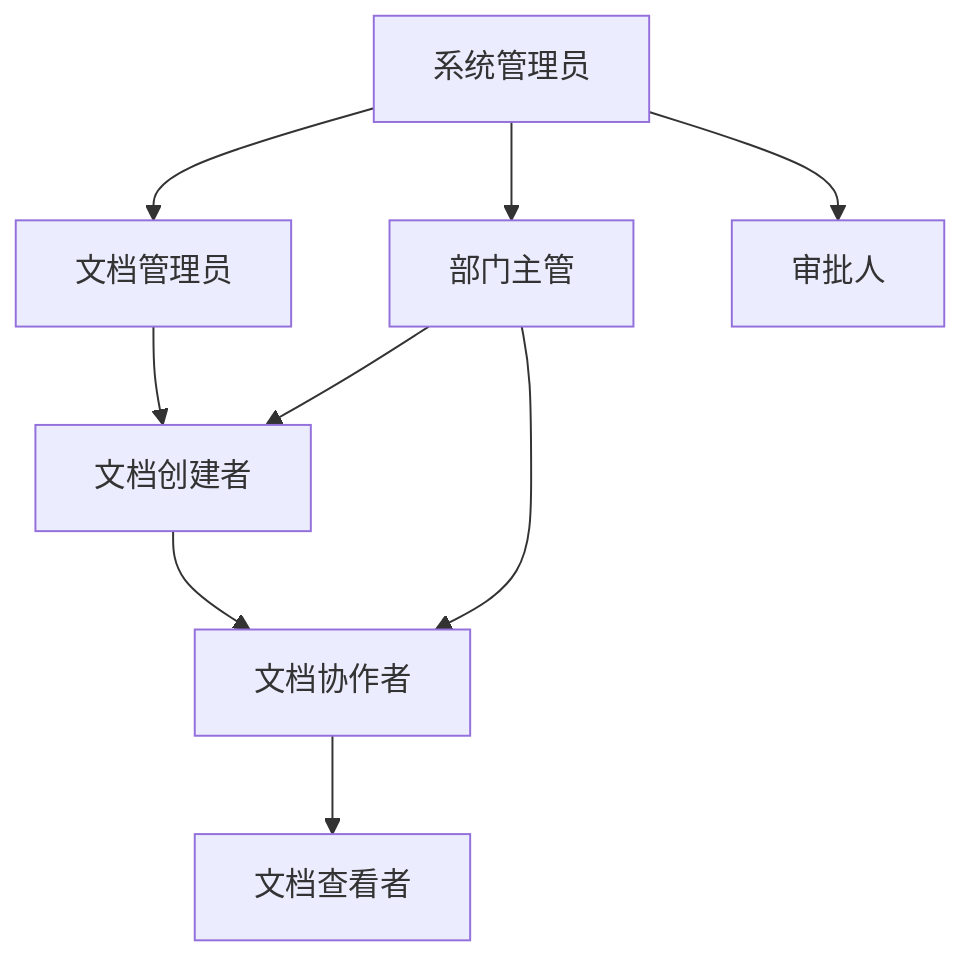
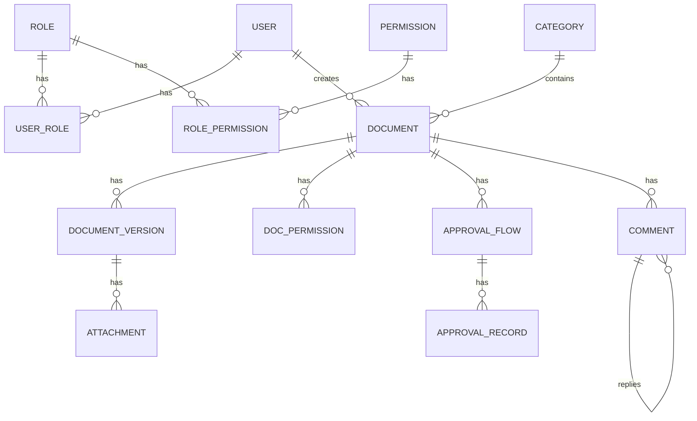

# 文档管理系统业务场景文档

## 1. 业务背景

### 1.1 业务背景概述

随着企业信息化程度的不断提升，文档已成为企业核心知识资产的重要组成部分。各类合同文档、技术资料、业务报表、规章制度等文件的数量呈爆发式增长，传统的文件管理方式已难以满足现代企业的管理需求。

**当前企业文档管理面临的主要挑战包括：**

| 挑战 | 说明 |
|------|------|
| 文档分散存储 | 文档散落在个人电脑、邮件附件、各类即时通讯工具中，缺乏统一管理 |
| 版本混乱 | 多人协作修改同一文档时，常出现版本覆盖、版本丢失等问题 |
| 查找困难 | 依靠人工记忆或简单文件夹分类已无法快速定位所需文档 |
| 权限失控 | 缺乏细粒度的权限控制机制，导致敏感文档被未授权人员访问 |
| 协作低效 | 依赖线下传递或邮件往返进行文档审阅，审批效率低下 |
| 知识流失 | 核心人员离职时，相关文档知识无法有效沉淀和传承 |

### 1.2 建设目标

通过建设统一的文档管理系统，实现对企业文档的**全生命周期管理**，提升文档管理效率，保障文档安全，促进知识沉淀与共享。

---

## 2. 业务流程

### 2.1 核心业务流程

```
用户上传文档 → 文档管理员接收 → 设置权限 → 提交审批 → 
审批人审批 → 审批通过后发布 → 创建版本记录
```

**详细步骤：**

1. **上传阶段**：用户上传文档，选择分类，设置标签
2. **审核阶段**：文档管理员接收并校验格式，设置权限
3. **审批阶段**：提交审批，审批人做出决策（通过/拒绝）
4. **发布阶段**：审批通过后发布文档，系统创建初始版本

### 2.2 文档协作与版本控制流程

```
用户A编辑 → 实时同步到用户B/C → 保存文档 → 创建新版本 → 
版本通知 → 可查看历史/回滚
```

**关键特性：**
- 实时协作：多人同时编辑，修改实时同步
- 版本控制：每次保存自动创建新版本
- 历史追溯：可查看任意历史版本，支持版本回滚

### 2.3 文档评论与批注流程

```
发起评论 → 关联文档位置 → 提交评论 → 通知相关人 → 
查看评论 → 回复讨论 → 标记已处理
```

---

## 3. 角色说明

### 3.1 系统角色定义

| 角色 | 描述 | 主要职责 | 权限范围 |
|------|------|----------|----------|
| 系统管理员 | 负责系统全局配置和运维 | 系统参数配置、用户管理、角色权限管理、系统监控 | 全部权限 |
| 文档管理员 | 负责文档库的日常管理 | 分类维护、标签管理、文档审核、归档管理 | 文档管理、审核权限 |
| 部门主管 | 部门文档的审批负责人 | 本部门文档审批、权限授予、文档监督 | 本部门文档全部权限 |
| 文档创建者 | 文档的上传和创建者 | 文档上传、编辑、提交审批、版本提交 | 自己创建的文档 |
| 文档协作者 | 参与文档共同编辑 | 实时协作编辑、评论、批注 | 被授权的文档 |
| 文档查看者 | 仅有查看权限的用户 | 浏览文档、下载文档、查看历史版本 | 被授权的文档查看 |
| 审批人 | 负责文档审批流程 | 审批决策、审批意见填写 | 分配的审批任务 |

### 3.2 角色关系图



### 3.3 角色权限矩阵

| 功能模块 | 系统管理员 | 文档管理员 | 部门主管 | 文档创建者 | 文档协作者 | 文档查看者 | 审批人 |
|----------|------------|------------|----------|------------|------------|------------|--------|
| 系统配置 | ● | ○ | ○ | ○ | ○ | ○ | ○ |
| 用户管理 | ● | ○ | ○ | ○ | ○ | ○ | ○ |
| 角色管理 | ● | ○ | ○ | ○ | ○ | ○ | ○ |
| 创建文档 | ● | ● | ● | ● | ○ | ○ | ○ |
| 编辑文档 | ● | ● | ● | ● | ● | ○ | ○ |
| 删除文档 | ● | ● | ● | ● | ○ | ○ | ○ |
| 审批文档 | ● | ● | ● | ○ | ○ | ○ | ● |
| 下载文档 | ● | ● | ● | ● | ● | ● | ○ |
| 权限管理 | ● | ● | ● | ○ | ○ | ○ | ○ |
| 版本回滚 | ● | ● | ● | ● | ○ | ○ | ○ |
| 查看历史 | ● | ● | ● | ● | ● | ● | ○ |
| 添加评论 | ● | ● | ● | ● | ● | ○ | ○ |
| 文档归档 | ● | ● | ○ | ○ | ○ | ○ | ○ |

**图例：** ● 完全权限 ○ 无权限

---

## 4. 业务实体

### 4.1 核心实体关系图



### 4.2 实体详细说明

#### 4.2.1 用户 (User)

| 字段名称 | 字段类型 | 必填 | 说明 |
|----------|----------|------|------|
| user_id | String | 是 | 用户唯一标识 |
| username | String | 是 | 用户登录名 |
| real_name | String | 是 | 用户真实姓名 |
| email | String | 是 | 用户邮箱 |
| phone | String | 否 | 用户手机号 |
| department | String | 是 | 所属部门 |
| position | String | 否 | 职位 |
| status | Integer | 是 | 账号状态(0禁用/1正常) |
| create_time | DateTime | 是 | 创建时间 |
| update_time | DateTime | 是 | 更新时间 |

#### 4.2.2 文档 (Document)

| 字段名称 | 字段类型 | 必填 | 说明 |
|----------|----------|------|------|
| doc_id | String | 是 | 文档唯一标识 |
| doc_title | String | 是 | 文档标题 |
| doc_content | Text | 否 | 文档内容 |
| category_id | String | 是 | 所属分类ID |
| file_type | String | 是 | 文件类型 |
| file_size | Long | 是 | 文件大小(字节) |
| file_path | String | 是 | 文件存储路径 |
| creator_id | String | 是 | 创建者ID |
| current_version | Integer | 是 | 当前版本号 |
| doc_status | Integer | 是 | 文档状态(0草稿/1审批中/2已发布/3已归档) |
| create_time | DateTime | 是 | 创建时间 |
| update_time | DateTime | 是 | 更新时间 |

#### 4.2.3 审批流程 (ApprovalFlow)

| 字段名称 | 字段类型 | 必填 | 说明 |
|----------|----------|------|------|
| flow_id | String | 是 | 流程唯一标识 |
| doc_id | String | 是 | 文档ID |
| flow_type | Integer | 是 | 流程类型(1新建审批/2修改审批/3删除审批) |
| flow_status | Integer | 是 | 流程状态(0进行中/1已通过/2已拒绝/3已撤回) |
| creator_id | String | 是 | 申请人ID |
| current_approver | String | 是 | 当前审批人ID |
| create_time | DateTime | 是 | 创建时间 |

---

## 5. 业务规则

### 5.1 文档管理规则

| 规则编号 | 规则名称 | 规则描述 |
|----------|----------|----------|
| DR-001 | 文件类型限制 | 系统支持上传的文件类型包括：Word、Excel、PowerPoint、PDF、图片、文本等 |
| DR-002 | 文件大小限制 | 单个文件大小上限默认为100MB |
| DR-003 | 文件名规范 | 文件名长度不能超过200个字符，不能包含特殊字符：/:*?"<> |
| DR-004 | 分类层级限制 | 文档分类最多支持5级层级结构 |
| DR-005 | 标签数量限制 | 单个文档最多允许添加10个标签 |
| DR-006 | 回收站机制 | 删除的文档进入回收站，回收站保留期限默认30天 |

### 5.2 版本控制规则

| 规则编号 | 规则名称 | 规则描述 |
|----------|----------|----------|
| VR-001 | 版本号规则 | 版本号采用整数递增方式，初始版本为1 |
| VR-002 | 版本提交记录 | 每次版本提交必须填写变更说明 |
| VR-003 | 版本保留策略 | 最近10个版本永久保留，历史版本保留最近24个 |
| VR-004 | 版本回滚权限 | 只有文档创建者、文档管理员、部门主管有权限进行版本回滚 |
| VR-005 | 协作版本控制 | 多人协作编辑时，系统自动每30秒保存一次协作快照 |

### 5.3 权限管理规则

| 规则编号 | 规则名称 | 规则描述 |
|----------|----------|----------|
| PR-001 | 权限继承规则 | 文档继承所在分类的权限配置，子分类可覆盖父分类权限 |
| PR-002 | 权限优先级 | 显式授予的权限优先于继承权限 |
| PR-003 | 权限过期机制 | 临时授权可设置过期时间，过期后自动失效 |
| PR-004 | 权限审计 | 所有权限变更操作记录详细审计日志 |

### 5.4 协作编辑规则

| 规则编号 | 规则名称 | 规则描述 |
|----------|----------|----------|
| CR-001 | 协作人数限制 | 单个文档同时在线协作人数上限默认为20人 |
| CR-002 | 冲突处理 | 多人同时编辑同一内容时，采用"最后保存优先"策略 |
| CR-003 | 协作锁定 | 用户可手动锁定文档段落，锁定后其他用户只能查看 |
| CR-004 | 自动锁定超时 | 文档段落锁定后超过30分钟无操作自动解锁 |

### 5.5 审批流程规则

| 规则编号 | 规则名称 | 规则描述 |
|----------|----------|----------|
| AR-001 | 审批时效 | 审批任务默认3个工作日内完成，超时自动提醒 |
| AR-002 | 审批转办 | 审批人可将审批任务转办给其他用户，转办次数上限为2次 |
| AR-003 | 审批驳回 | 审批驳回时必须填写驳回理由，文档状态变更为"草稿" |
| AR-004 | 审批撤回 | 申请人可在审批过程中撤回申请 |

---

## 6. 验收标准

### 6.1 文档管理功能验收标准

| 验收项 | 验收条件 |
|--------|----------|
| 文档上传 | 支持拖拽和点击上传，文件类型和大小正确校验 |
| 文档下载 | 支持原格式下载，下载内容与上传内容一致 |
| 文档分类 | 支持树形分类展示，支持分类增删改查 |
| 文档标签 | 支持添加/移除标签，支持标签筛选 |
| 文档搜索 | 支持按标题、内容、标签、分类搜索 |
| 文档删除 | 支持直接删除和回收站删除，恢复功能正常 |

### 6.2 版本控制功能验收标准

| 验收项 | 验收条件 |
|--------|----------|
| 版本自动记录 | 每次保存自动创建新版本，版本号正确递增 |
| 版本历史查看 | 可查看任意历史版本的内容 |
| 版本对比 | 支持两个版本之间的差异对比 |
| 版本回滚 | 回滚后生成新版本，原版本保留 |

### 6.3 权限管理功能验收标准

| 验收项 | 验收条件 |
|--------|----------|
| 权限授予 | 可对用户/角色/部门授予不同级别的权限 |
| 权限继承 | 子分类可继承父分类权限 |
| 权限验证 | 无权限用户无法访问受保护文档 |
| 权限审计 | 所有权限变更记录可查询 |

### 6.4 在线协作功能验收标准

| 验收项 | 验收条件 |
|--------|----------|
| 实时协作 | 多人同时编辑，修改实时同步 |
| 协作冲突 | 冲突场景正确处理，无数据丢失 |
| 评论功能 | 支持添加、回复、删除评论 |
| 批注功能 | 支持添加、删除批注 |

### 6.5 工作流功能验收标准

| 验收项 | 验收条件 |
|--------|----------|
| 审批发起 | 提交审批后文档状态变为"审批中" |
| 审批通过 | 审批通过后文档状态变为"已发布" |
| 审批驳回 | 审批驳回后文档状态变为"草稿" |
| 审批转办 | 转办功能正常，原审批人收到通知 |

### 6.6 性能与安全验收标准

| 验收项 | 验收条件 |
|--------|----------|
| 响应时间 | 页面加载时间不超过3秒，搜索响应时间不超过2秒 |
| 并发能力 | 支持100用户同时在线操作 |
| 数据安全 | 敏感数据加密存储，传输使用HTTPS |
| 备份恢复 | 支持自动备份，可恢复到任意时间点 |

---

**文档版本**: v1.0  
**创建日期**: 2026-03-17  
**文档状态**: 正式发布